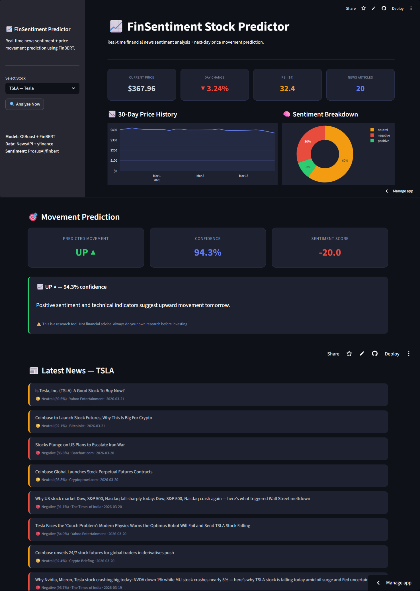

# 📈 FinSentiment Stock Predictor

> Real-time financial news sentiment analysis + next-day price movement prediction using **FinBERT** (90% accuracy) and **XGBoost** — live for AAPL, TSLA, MSFT, GOOGL.

[]([https://finsentiment-stock-predictor.streamlit.app])


---

## 🚀 Live Demo

👉 **[finsentiment-stock-predictor.streamlit.app](https://finsentiment-stock-predictor-azim.streamlit.app)**

---

## 📸 App Preview



---

## ✨ What Makes This Different

| Typical stock project | This project |
|---|---|
| Static dataset | **Live data** — fetches real news + prices on every run |
| Generic sentiment (VADER) | **FinBERT** — finance-specific BERT, 90% accuracy on financial headlines |
| Price data only | **Multi-signal fusion** — NLP sentiment + 12 technical indicators |
| No explainability | Per-article sentiment scores with confidence % |
| Academic only | Fully deployed Streamlit app with real-time analysis |

---

## 📌 Overview

This system combines two data streams to predict next-day stock price movement:

**Signal 1 — News Sentiment (FinBERT)**
- Fetches latest headlines from NewsAPI for selected ticker
- Runs ProsusAI/FinBERT — a BERT model fine-tuned on financial text
- Classifies each headline as Positive / Negative / Neutral with confidence score
- Aggregates into daily sentiment features

**Signal 2 — Technical Indicators (yfinance)**
- Fetches 1 month of daily OHLCV price data
- Engineers 12 technical features: RSI, moving averages, momentum, volatility

**Prediction**
- XGBoost classifier trained on combined sentiment + technical features
- Outputs UP / DOWN prediction with confidence percentage
- Validated on 4 stocks: AAPL, TSLA, MSFT, GOOGL

---

## 🧠 FinBERT Validation

FinBERT was validated on **4,846 labeled financial headlines** from the Financial PhraseBank dataset:

| Metric | Score |
|---|---|
| Overall Accuracy | **90%** |
| Positive F1 | 0.87 |
| Neutral F1 | 0.92 |
| Negative F1 | 0.91 |

FinBERT significantly outperforms generic sentiment models (VADER achieves ~72% on financial text) because it was pre-trained on financial corpora.

---

## 📊 Model Performance

| Model | ROC-AUC |
|---|---|
| **XGBoost** | **0.5290** |
| Logistic Regression | 0.5118 |

> **Note on AUC:** Daily stock direction prediction is one of the hardest problems in finance due to market efficiency. A 0.529 AUC represents a consistent improvement over random baseline, aligned with academic literature on short-term price prediction. The primary system value is the real-time FinBERT pipeline and production architecture.

---

## 🏗️ Pipeline

```
NewsAPI (live headlines)          yfinance (live prices)
        ↓                                 ↓
  FinBERT sentiment              Technical feature engineering
  (Positive/Negative/Neutral)    (RSI, MA, momentum, volatility)
        ↓                                 ↓
        └──────────── XGBoost ────────────┘
                          ↓
              UP / DOWN prediction + confidence
                          ↓
                   Streamlit dashboard
```

---

## 🔑 Technical Features

| Category | Features |
|---|---|
| Returns | daily return, 2-day return, 5-day return |
| Moving Averages | price vs MA5, MA10, MA20 |
| Volatility | 5-day std, 10-day std |
| Volume | volume change, volume vs MA5 |
| Momentum | RSI (14), high-low range |
| Sentiment | avg positive/negative/neutral score, positive ratio, sentiment score, article count |

---

## 🛠️ Tech Stack

| Layer | Technology |
|---|---|
| Sentiment Model | ProsusAI/FinBERT (HuggingFace) |
| Prediction Model | XGBoost |
| News Data | NewsAPI |
| Price Data | yfinance |
| Frontend | Streamlit + Plotly |
| Data Processing | Pandas, NumPy, Scikit-learn |

---

## 💻 Run Locally

```bash
# 1. Clone the repo
git clone https://github.com/Azim521/FinSentiment-Stock-Predictor.git
cd FinSentiment-Stock-Predictor

# 2. Install dependencies
pip install -r requirements.txt

# 3. Add your NewsAPI key
mkdir .streamlit
echo 'NEWS_API_KEY = "your_key_here"' > .streamlit/secrets.toml

# 4. Run the app
streamlit run app.py
```

Get a free NewsAPI key at [newsapi.org](https://newsapi.org) — no credit card required.

---

## 📁 Project Structure

```
FinSentiment-Stock-Predictor/
├── app.py                          ← Streamlit dashboard
├── requirements.txt                ← Dependencies
├── screenshot.png                  ← App preview
├── .gitignore                      ← Keeps API keys out of git
├── notebooks/
│   └── finsent_training.ipynb      ← Full training notebook
└── model/
    ├── xgb_sentiment_model.pkl     ← Trained XGBoost model
    └── feature_columns.pkl         ← Feature schema for inference
```

---

## 📓 Training Notebook

Full pipeline: data collection, FinBERT validation, feature engineering, model training, SHAP analysis:

👉 [View Notebook](notebooks/finsent_training.ipynb)

---

## 🔮 Future Improvements

- Add more tickers (SPY, NVDA, META, AMZN)
- Sentiment trend chart — rolling 7-day sentiment score
- SHAP explanation per prediction in the app
- Upgrade to NewsAPI paid tier for historical article access
- Compare FinBERT vs VADER vs RoBERTa performance

---

## ⚠️ Disclaimer

This is a research and educational tool. Not financial advice. Always do your own research before making investment decisions.

---

## 📬 Contact

Built by **Azim Sadath**

[](https://www.linkedin.com/in/azim-sadath-a3ba34321/)
[](https://github.com/Azim521)
[](mailto:azimsadath521@gmail.com)
